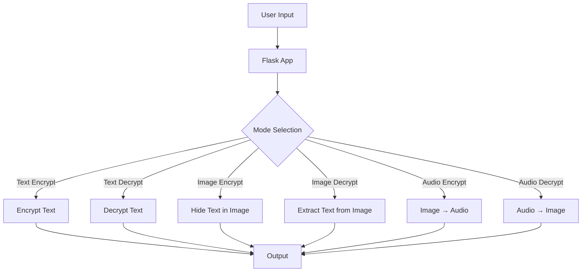
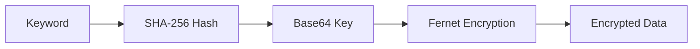
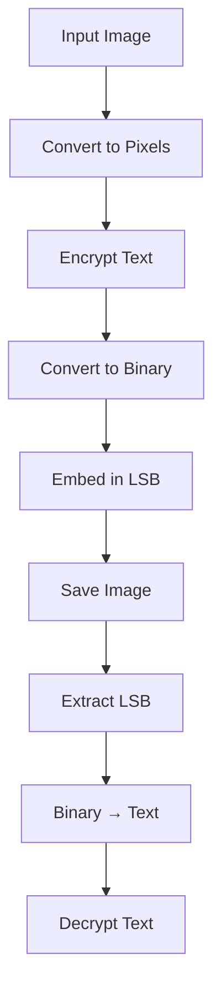
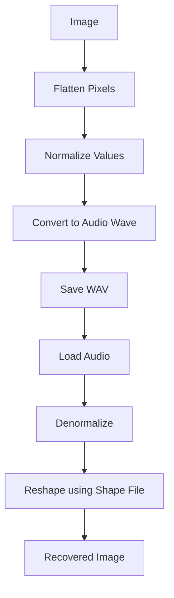

# 🔐 StegoCrypt Web App  
**Image • Audio • Text Encryption & Steganography Tool**

A Flask-based web application that enables secure **text encryption**, **image steganography**, and **image–audio transformation** using cryptographic techniques.

---

## 🚀 Features

- 🔑 Text Encryption / Decryption (Fernet + SHA-256)
- 🖼️ Hide text inside images (LSB Steganography)
- 🔍 Extract hidden messages from images
- 🔊 Convert images to audio
- 🔁 Recover images from audio
- 🔐 Keyword-based secure transformations

---

## 🏗️ System Architecture



---

## 🔐 Encryption Workflow



---

## 🖼️ Image Steganography (LSB)



---

## 🔊 Image ↔ Audio Conversion



---

## 📁 Project Structure

```
project/
│
├── static/
│   └── uploads/
│
├── templates/
│   ├── base.html
│   ├── index.html
│   ├── tool.html
│   ├── about.html
│   ├── guide.html
│   └── donate.html
│
├── app.py
├── requirements.txt
└── README.md
```

---

## ⚙️ Installation

```bash
git clone https://github.com/your-username/stegocrypt.git
cd stegocrypt

python -m venv venv
source venv/bin/activate      # Linux/Mac
venv\Scripts\activate         # Windows

pip install -r requirements.txt
```

---

## ▶️ Run the App

```bash
python app.py
```

Open in browser:

```
http://127.0.0.1:5000/
```

---

## 🛠️ Usage

### 🔑 Text Encryption
- Go to: `/tool/text-encrypt`
- Enter text + keyword

### 🔓 Text Decryption
- Go to: `/tool/text-decrypt`

### 🖼️ Hide Text in Image
- Upload image + message + keyword  
- Download encrypted image

### 🔍 Extract Hidden Text
- Upload encoded image + keyword

### 🔊 Image → Audio
- Upload image  
- Download `.wav` + `.npy`

### 🔁 Audio → Image
- Upload `.wav` + `.npy`  
- Enter keyword → recover image

---

## 🔐 Security Details

- Hashing: SHA-256  
- Encryption: Fernet (symmetric)  
- Steganography: LSB encoding  
- Key Derivation: Keyword → Hash → Key  

---

## ⚠️ Limitations

- Message size limited by image capacity  
- Shape file required for audio decoding  
- Incorrect keyword = decryption failure  
- Large files may impact performance  

---

## 🧰 Tech Stack

- Backend: Flask  
- Libraries:
  - cryptography
  - numpy
  - opencv-python
  - pillow
  - scipy

---

## 💡 Future Enhancements

- 🔐 User authentication
- ☁️ Cloud storage (AWS S3)
- 📡 API endpoints
- 🎨 Drag & drop UI
- 🤖 AI-based image optimization

---

## 🤝 Contributing

```
fork → clone → create branch → commit → push → PR
```

---

## 📜 License

MIT License

---

## 👨‍💻 Author

**Adit Sharma**
